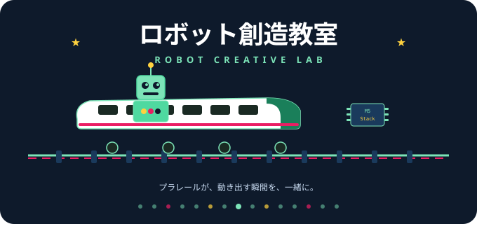

# 🚄 ロボット創造教室 公式サイト



> プラレールを M5Stack で改造して、自分だけのロボット列車をつくろう。

[](https://creative-robotics-project-web-site.vercel.app)
[](LICENSE)

---

## 🎯 作成の動機

長野県茅野市で開催している小学生向けプログラミング教室「ロボット創造教室」の情報を発信するために作成しました。

活動を続けていくなかで、以下の課題を感じていました。

- 開催情報や活動報告を都度 SNS で発信するだけでは情報が埋もれてしまう
- 参加を検討している保護者が教室の雰囲気・内容をまとめて確認できる場所がなかった
- JSON ファイルの手書き管理はミスが起きやすく、更新のたびにビルド・デプロイが必要だった

これらを解決するために、**バックエンドと連携した動的なランディングページ**として設計しました。

---

## 🌐 サイト概要

| 項目     | 内容                                                  |
| -------- | ----------------------------------------------------- |
| URL      | https://creative-robotics-project-web-site.vercel.app |
| 対象     | 幼児（年長）〜小学6年生とその保護者                   |
| 開催地   | 長野県茅野市                                          |
| 更新頻度 | イベント開催ごと                                      |

---

## 🛠 技術構成

### フロントエンド

| 技術           | 選定理由                                                |
| -------------- | ------------------------------------------------------- |
| **Vite**       | 高速なビルドと HMR（Hot Module Replacement）でDX が高い |
| **React**      | コンポーネント分割による保守性の高さ                    |
| **TypeScript** | 型安全性により JSON の手書きミスをビルド時に検出できる  |

### バックエンド

| 技術         | 選定理由                                                                                                  |
| ------------ | --------------------------------------------------------------------------------------------------------- |
| **Supabase** | PostgreSQL ベースで Table Editor による GUI 管理が直感的。活動報告・イベント情報の更新が SQL 不要で行える |

### インフラ・CI/CD

| 技術               | 用途                                                        |
| ------------------ | ----------------------------------------------------------- |
| **Vercel**         | `main` ブランチへのプッシュで自動デプロイ                   |
| **GitHub Actions** | Supabase の無料プラン自動停止（2週間）を防ぐための定期 ping |

---

## 🗄 データベース構造

Supabase（PostgreSQL）を使用。

### `events` テーブル — イベント情報

| カラム           | 型   | 説明                                 |
| ---------------- | ---- | ------------------------------------ |
| `id`             | int8 | 主キー                               |
| `date`           | text | 開催日（内部管理用）例: `2026.06.15` |
| `date_label`     | text | 表示用ラベル 例: `6/15`              |
| `day_of_week`    | text | 曜日 例: `日`                        |
| `place`          | text | 会場名（内部管理用）                 |
| `place_label`    | text | 表示用会場名                         |
| `capacity`       | int4 | 定員                                 |
| `age_range`      | text | 対象年齢 例: `幼児〜小6`             |
| `status`         | text | `coming_soon` / `open` / `closed`    |
| `google_form_id` | text | Google フォームの ID                 |

### `reports` テーブル — 活動報告

| カラム          | 型     | 説明                                             |
| --------------- | ------ | ------------------------------------------------ |
| `id`            | int8   | 主キー                                           |
| `date`          | text   | 開催日 例: `2026.03.15`                          |
| `title`         | text   | タイトル                                         |
| `place`         | text   | 会場名                                           |
| `body`          | text   | 本文                                             |
| `color`         | text   | アクセントカラー `primary` / `accent` / `yellow` |
| `images`        | text[] | 画像 URL 配列                                    |
| `instagram_url` | text   | Instagram 投稿 URL                               |
| `sort_order`    | int4   | 表示順（小さい順）                               |

### `faq` テーブル — よくある質問（将来用）

| カラム       | 型   | 説明   |
| ------------ | ---- | ------ |
| `id`         | int8 | 主キー |
| `question`   | text | 質問文 |
| `answer`     | text | 回答文 |
| `sort_order` | int4 | 表示順 |

### `contacts` テーブル — お問い合わせ受付（将来用）

| カラム     | 型   | 説明           |
| ---------- | ---- | -------------- |
| `id`       | int8 | 主キー         |
| `name`     | text | お名前         |
| `email`    | text | メールアドレス |
| `message`  | text | メッセージ     |
| `category` | text | 種別           |

---

## 📁 ファイル構成

```
src/
├── assets/               # 画像ファイル
│   ├── FlowImages/       # 授業風景写真
│   ├── header.jpeg       # ヒーロー画像
│   └── teacher_kake.jpg  # 講師写真
├── components/
│   └── ShinkansenSVG.tsx # 新幹線SVGコンポーネント
├── contexts/
│   └── PageContext.tsx   # ページ遷移管理
├── data/                 # ハードコードデータ（JSON）
│   ├── contact.json      # お問い合わせフォームID
│   ├── event.json        # イベント情報（未使用・Supabase移行済み）
│   ├── faq.json          # FAQ（未使用・ハードコード）
│   ├── partners.json     # 協力団体
│   ├── reports.json      # 活動報告（未使用・Supabase移行済み）
│   └── teachers.json     # 講師情報
├── lib/
│   └── supabase.ts       # Supabaseクライアント初期化
├── sections/             # ページセクション
│   ├── Access.tsx        # 会場案内
│   ├── ActivityReport.tsx# 活動報告ページ（Supabase連携）
│   ├── Contact.tsx       # お問い合わせページ
│   ├── Cta.tsx           # 申し込みCTA（Supabase連携）
│   ├── Faq.tsx           # よくある質問
│   ├── Features.tsx      # 教室の強み
│   ├── Flow.tsx          # 1日の流れ
│   ├── Footer.tsx        # フッター
│   ├── Hero.tsx          # ヒーローセクション（Supabase連携）
│   ├── Nav.tsx           # ナビゲーション
│   ├── Partners.tsx      # 協力団体ページ
│   └── Teacher.tsx       # 講師紹介
├── theme/
│   ├── ThemeContext.tsx   # テーマ管理
│   └── tokens.ts         # デザイントークン（色・スタイル定数）
└── App.tsx               # ルートコンポーネント・ページ切り替え
```

---

## 🚀 セットアップ

### 必要環境

- Node.js 18 以上
- npm 9 以上

### インストール

```bash
git clone https://github.com/immunity428/creative-robotics-project-web-site.git
cd creative-robotics-project-web-site
npm install
```

### 環境変数の設定

`.env` ファイルをプロジェクトルートに作成してください。

```
VITE_SUPABASE_URL=https://your-project.supabase.co
VITE_SUPABASE_ANON_KEY=your-anon-key
```

### 起動

```bash
npm run dev
```

---

## 📝 コンテンツの更新方法

### イベント情報を更新する

Supabase の Table Editor → `events` テーブルを開いて以下を編集します。

| やること         | 更新するカラム                        |
| ---------------- | ------------------------------------- |
| 開催日を設定     | `date` / `date_label` / `day_of_week` |
| 会場を設定       | `place` / `place_label`               |
| フォームを有効化 | `google_form_id`                      |
| 受付開始         | `status` を `open` に変更             |

### 活動報告を追加する

Supabase の Table Editor → `reports` テーブルに新しい行を INSERT します。`sort_order` を小さくすると上に表示されます。

---

## 🔄 CI/CD

| トリガー                   | 動作                                  |
| -------------------------- | ------------------------------------- |
| `main` ブランチへの push   | Vercel が自動ビルド・デプロイ         |
| 10日ごと（GitHub Actions） | Supabase に ping を送り自動停止を防止 |

---

## 📏 開発ルール

### コミットメッセージ

```
[Type]: [日本語でタイトル]
例: feat: 活動報告ページにInstagram埋め込みを追加
```

| Type       | 用途                       |
| ---------- | -------------------------- |
| `feat`     | 新機能の追加・変更         |
| `fix`      | バグ修正                   |
| `refactor` | リファクタリング           |
| `style`    | スタイル・フォーマット修正 |
| `docs`     | ドキュメント更新           |
| `chore`    | 設定ファイルなどの修正     |
| `ci`       | CI/CD の変更               |

### ブランチ名

```
feat/[scope]/[description]
fix/[scope]/[description]
例: feat/backend/supabase-integration
```
